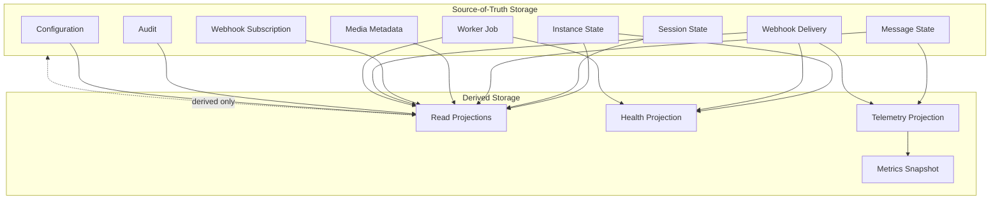

# Storage Ownership

## Purpose

This document defines logical storage ownership for OmniWA Phase 5.1.

It does not define database tables, schemas, indexes, SQL, Prisma, migrations, ORM models, or physical storage topology.

## Ownership Principles

- Each source-of-truth logical storage has exactly one owning context.
- Each source-of-truth logical storage persists one aggregate root's state.
- Non-owner contexts may read safe snapshots only through Application queries, projections, or approved repository access patterns.
- Non-owner contexts must not write another aggregate's storage.
- Derived read projections may combine multiple sources, but they do not own source state.
- Archive copies remain owned by the source context.

## Storage Ownership Matrix

| Logical Storage | Owner Context | Owner Aggregate | Read Access | Write Access | Archive Policy | Retention Dependency |
|---|---|---|---|---|---|---|
| Instance State Storage | Instance | Instance | Instance workflows, status queries, health projections via safe reference | InstanceRepositoryPort only | Destroyed instance summary may archive after retention | Instance lifecycle and audit retention |
| Session State Storage | Session | Session | Instance/session workflows through safe session reference | SessionRepositoryPort only | Expired/revoked/cleaned session metadata may archive; Secret material excluded | Session retention and backup/recovery policy |
| Messaging State Storage | Messaging | Message | Messaging workflows, status/history projections | MessageRepositoryPort only | Delivery history may archive; body excluded by default | Message metadata retention |
| Media Metadata Storage | Media | MediaAsset | Media workflows, message workflows via Application snapshots | MediaAssetRepositoryPort only | Metadata/diagnostic summary may archive; binary excluded by default | Media retention and diagnostic capture policy |
| Webhook Subscription Storage | Webhook Delivery | WebhookSubscription | Webhook workflows and admin queries | WebhookSubscriptionRepositoryPort only | Retired subscription metadata may archive | Webhook config retention |
| Webhook Delivery Storage | Webhook Delivery | WebhookDelivery | Webhook delivery workflows, delivery history queries | WebhookDeliveryRepositoryPort only | Delivery history/dead-letter summaries may archive | Webhook delivery log retention |
| Guardrail Decision Storage | Guardrails | GuardrailDecision | Messaging acceptance workflows, audit/health projection | GuardrailDecisionRepositoryPort only | Decision summary may archive within policy | Guardrail/audit retention |
| Provider Profile Storage | Provider Integration | ProviderProfile | Provider workflows, health/configuration reads | ProviderProfileRepositoryPort only | Old capability snapshots may archive | Provider compatibility retention |
| Worker Job Storage | Operations | WorkerJob | Worker workflows, owner workflows via Application, monitoring queries | WorkerJobRepositoryPort only | Completed/dead jobs may archive after operational retention | Queue/worker retention |
| Access Decision Storage | Security and Access | AccessDecision | Application authorization workflows and audit | AccessDecisionRepositoryPort only | Expired decisions may archive as audit-safe summary | Access/audit retention |
| Audit Storage | Audit | AuditRecord | Admin audit queries only through approved access | AuditRecordRepositoryPort only | Audit archive according to audit retention | Audit retention |
| Health Projection Storage | Health | HealthStatus | Monitoring queries, status views, action-required views | HealthStatusRepositoryPort only | Health history may archive or compact | Health/observability retention |
| Configuration Storage | Configuration | ConfigurationSnapshot | Configuration workflows, safe status queries | ConfigurationSnapshotRepositoryPort only | Superseded/rejected snapshots may archive | Configuration/audit retention |
| Telemetry Projection Storage | Observability | TelemetrySignal | Metrics projections and observability workflows | TelemetrySignalRepositoryPort only | Sanitized telemetry may aggregate/archive; unsafe dropped | Observability retention |
| Read Projection Storage | Projection owner per read model | Derived; source aggregate remains owner | Application queries and API responses | Projection workflow only | Derived projection can be rebuilt/expired | Source retention and query contract |
| Future Archive Storage | Source owner context | Source aggregate remains owner | Recovery/audit/admin reads only when approved | Archive workflow under source owner | Long-term archive only if policy permits | Same or stricter than source |
| Future Analytics Storage | Future analytics context | None for source data | Deferred | Deferred | Deferred | Requires future product decision |

## Read Access Rules

Read access means safe Application-level access, not direct storage coupling.

Rules:

- Application queries may compose safe read models.
- Repository ports expose owner aggregate state only.
- Non-owner contexts receive safe snapshots, source references, or published language.
- Read models must preserve authorization, retention, and data classification.
- Metrics and monitoring reads must not become analytics product scope.

## Write Access Rules

Write access is exclusive to the owner repository port or projection workflow.

Rules:

- InstanceRepositoryPort writes Instance State Storage only.
- SessionRepositoryPort writes Session State Storage only.
- MessageRepositoryPort writes Messaging State Storage only.
- WebhookDeliveryRepositoryPort writes Webhook Delivery Storage only.
- Projection workflows write derived projection state only and never source aggregate state.
- Archive workflows act under source owner context and retention policy.

## Ownership Anti-Patterns

| Anti-Pattern | Why Forbidden |
|---|---|
| Messaging writes Session state to mark send eligibility | Session owns session lifecycle; Messaging consumes safe session snapshot. |
| WebhookDelivery mutates Message after receiver failure | Webhook delivery failure cannot mutate source business fact. |
| WorkerJob decides Message business outcome | Operations owns work lifecycle; owner context interprets result. |
| HealthStatus repairs source aggregate state | Health is projection only. |
| Read Projection becomes command source of truth | Queries cannot mutate or replace write model. |
| Audit stores raw source payload to "preserve evidence" | Audit evidence must be Secret-safe and redacted. |
| ProviderProfile expands MVP message support | Provider capability cannot override Product Scope. |

## Storage Ownership Diagram

## Archive Ownership

Archive ownership follows source ownership.

Rules:

- Archived Instance state remains Instance-owned.
- Archived Message history remains Messaging-owned.
- Archived WebhookDelivery history remains Webhook-owned.
- Archived Audit evidence remains Audit-owned.
- Archive cannot create a new source of truth.
- Archive cannot restore expired sensitive data into normal API responses.
- Archive must preserve or strengthen classification and access controls.
