# Architecture Inventory

## Scope

This inventory is based only on the current repository source tree, package manifests, command/query/workflow catalogs, repository ports, adapters, tooling, and existing design documents.

It does not assume runtime behavior that is not present in source.

## Repository State

| Area                              | Current Evidence                                                    |
| --------------------------------- | ------------------------------------------------------------------- |
| Package manager                   | `pnpm@11.5.2` in root `package.json`                                |
| Runtime language                  | TypeScript / Node.js, ESM packages                                  |
| Root checks                       | `lint`, `typecheck`, `test`, `arch:check`, `release:check`, `check` |
| Architecture gate                 | `tooling/architecture/check-boundaries.mjs`                         |
| Release readiness gate            | `tooling/release/check-readiness.mjs`                               |
| Current git state when reviewed   | `main...origin/main`, clean                                         |
| HTTP framework                    | Not present in package manifests or source                          |
| OpenAPI generator/spec            | Not present                                                         |
| Database schema/migration tooling | Not present                                                         |
| Production storage adapters       | Not present; in-memory and planning artifacts exist                 |

## Apps

| App                       | Current Source                                        | Status                                 |
| ------------------------- | ----------------------------------------------------- | -------------------------------------- |
| `apps/api`                | `src/index.ts` exports nothing                        | Shell only                             |
| `apps/worker`             | `src/index.ts` exports nothing                        | Shell only                             |
| `apps/provider-runtime`   | `src/index.ts` exports nothing                        | Shell only                             |
| `apps/webhook-dispatcher` | `src/index.ts` exports nothing                        | Shell only                             |
| `apps/projection-builder` | `src/index.ts` exports nothing                        | Shell only                             |
| `apps/metrics`            | `src/index.ts` exports nothing                        | Shell only                             |
| `apps/health`             | `src/index.ts` exports nothing                        | Shell only                             |
| `apps/scheduler`          | `scheduler-runtime.ts` and tests                      | Implemented runtime helper             |
| `apps/background`         | `background-jobs.ts`, `recovery-validation.ts`, tests | Implemented background/recovery helper |

## Packages

| Package                                   | Dependencies                               | Current Responsibility                                                               |
| ----------------------------------------- | ------------------------------------------ | ------------------------------------------------------------------------------------ |
| `@omniwa/shared`                          | none                                       | Opaque values, result, request context, clock, UUID                                  |
| `@omniwa/errors`                          | shared                                     | OmniWA error and safe metadata primitives                                            |
| `@omniwa/config`                          | errors, shared                             | Configuration and secret provider contracts                                          |
| `@omniwa/observability`                   | errors, shared                             | Logger, redaction, metrics, tracing, health contracts                                |
| `@omniwa/domain`                          | shared                                     | Domain aggregates, value objects, policies, specs, events, repository ports          |
| `@omniwa/application`                     | domain, shared                             | Commands, queries, workflows, ports, internal event bus, authorization/audit service |
| `@omniwa/interface-api`                   | application, shared                        | Internal API adapter over Application commands/queries                               |
| `@omniwa/infrastructure-persistence`      | application, domain, shared                | In-memory repositories, read projection store, repository adapter plan               |
| `@omniwa/infrastructure-queue`            | application, domain, shared                | In-memory queue provider                                                             |
| `@omniwa/infrastructure-provider-baileys` | application, domain, shared, Baileys       | Baileys messaging provider adapter boundary                                          |
| `@omniwa/infrastructure-object-storage`   | application, domain, shared                | Object storage media store adapter                                                   |
| `@omniwa/infrastructure-webhook`          | application, domain, shared                | Webhook transport and dispatcher runtime                                             |
| `@omniwa/infrastructure-observability`    | observability, shared                      | In-memory observability runtime                                                      |
| `@omniwa/infrastructure-secrets`          | none                                       | Empty package shell                                                                  |
| `@omniwa/testing`                         | application, domain, observability, shared | Fake clock, UUID, event bus, memory logger, sensitive fixtures                       |

## Actual Package Dependency Diagram

```mermaid
flowchart TD
  Shared["@omniwa/shared"]
  Errors["@omniwa/errors"]
  Config["@omniwa/config"]
  Observability["@omniwa/observability"]
  Domain["@omniwa/domain"]
  Application["@omniwa/application"]
  InterfaceApi["@omniwa/interface-api"]
  InfraPersistence["@omniwa/infrastructure-persistence"]
  InfraQueue["@omniwa/infrastructure-queue"]
  InfraProvider["@omniwa/infrastructure-provider-baileys"]
  InfraObject["@omniwa/infrastructure-object-storage"]
  InfraWebhook["@omniwa/infrastructure-webhook"]
  InfraObservability["@omniwa/infrastructure-observability"]
  InfraSecrets["@omniwa/infrastructure-secrets"]
  Testing["@omniwa/testing"]
  Baileys["@whiskeysockets/baileys"]

  Errors --> Shared
  Config --> Errors
  Config --> Shared
  Observability --> Errors
  Observability --> Shared
  Domain --> Shared
  Application --> Domain
  Application --> Shared
  InterfaceApi --> Application
  InterfaceApi --> Shared
  InfraPersistence --> Application
  InfraPersistence --> Domain
  InfraPersistence --> Shared
  InfraQueue --> Application
  InfraQueue --> Domain
  InfraQueue --> Shared
  InfraProvider --> Application
  InfraProvider --> Domain
  InfraProvider --> Shared
  InfraProvider --> Baileys
  InfraObject --> Application
  InfraObject --> Domain
  InfraObject --> Shared
  InfraWebhook --> Application
  InfraWebhook --> Domain
  InfraWebhook --> Shared
  InfraObservability --> Observability
  InfraObservability --> Shared
  Testing --> Application
  Testing --> Domain
  Testing --> Observability
  Testing --> Shared
```

## Domain Modules Present In Source

| Domain Module             | Source Evidence                                                       |
| ------------------------- | --------------------------------------------------------------------- |
| Instance                  | `packages/domain/src/instance/instance.ts`                            |
| Session                   | `packages/domain/src/session/session.ts`                              |
| Message                   | `packages/domain/src/messaging/message.ts`, message type/direction    |
| Media                     | `packages/domain/src/media/media-asset.ts`, media category            |
| Webhook                   | `webhook-subscription.ts`, `webhook-delivery.ts`, webhook URL         |
| Worker Job / Queue domain | `operations/worker-job.ts`, job status, retry policy                  |
| Provider                  | `provider/provider-profile.ts`                                        |
| Audit                     | `audit/audit-record.ts`                                               |
| Health                    | `health/health-status.ts`                                             |
| Telemetry                 | `observability/telemetry-signal.ts`                                   |
| Configuration             | `configuration/configuration-snapshot.ts`                             |
| Guardrails                | `guardrails/guardrail-decision.ts`, guardrail policies/specifications |
| Access / Security         | `security/access-decision.ts`, access outcome/status                  |
| Events                    | `events/domain-event.ts`, `events/event-contract.ts`                  |

## Domain Modules Absent In Source

| Platform Domain             | Current Evidence                                                                                      |
| --------------------------- | ----------------------------------------------------------------------------------------------------- |
| Chat                        | Only mentioned in docs as deferred/future; no source module, aggregate, repository, command, or query |
| Contact                     | Only docs/value-object references; no source module, aggregate, repository, command, or query         |
| Group                       | Docs state deferred; no source module, aggregate, repository, command, or query                       |
| Group Member                | No source model                                                                                       |
| Label                       | No source model                                                                                       |
| Broadcast                   | Guardrail/out-of-scope references only; no source module                                              |
| Event Log                   | Domain event contracts exist, but no event log aggregate/read model/API                               |
| Log Query                   | Logger contracts exist, but no log storage/query model/API                                            |
| API Client/API Key resource | API credential type exists in interface adapter, but no resource/domain/repository                    |

## Application Commands

Application command groups are implemented in `packages/application/src/commands/command-catalog.ts`.

| Group          | Commands                                                                                                                                                                                                                                                         |
| -------------- | ---------------------------------------------------------------------------------------------------------------------------------------------------------------------------------------------------------------------------------------------------------------- |
| Instance       | `CreateInstance`, `UpdateInstanceMetadata`, `ConnectInstance`, `StartQrPairing`, `RefreshQrPairing`, `ConfirmSessionActivated`, `DisconnectInstance`, `ReconnectInstance`, `MarkInstanceLoggedOut`, `DestroyInstance`                                            |
| Messaging      | `SendTextMessage`, `SendMediaMessage`, `EvaluateOutboundGuardrails`, `ProcessOutboundMessageWork`, `ApplyProviderMessageStatus`, `ReceiveInboundMessage`, `ClassifyUnsupportedInboundMessage`, `RetryMessageSend`, `CancelMessage`                               |
| Media          | `RegisterMedia`, `ProcessMediaWork`, `AttachMediaToMessageWorkflow`, `RequestDiagnosticCapture`, `CleanupMediaRetention`                                                                                                                                         |
| Webhook        | `RegisterWebhookSubscription`, `UpdateWebhookSubscription`, `ActivateWebhookSubscription`, `SuspendWebhookSubscription`, `RetireWebhookSubscription`, `ScheduleWebhookDelivery`, `DeliverWebhookWork`, `RetryWebhookDelivery`, `MoveWebhookDeliveryToDeadLetter` |
| Provider       | `EvaluateProviderCompatibility`, `HandleProviderConnectionSignal`, `HandleProviderAuthSignal`, `HandleProviderMessageSignal`, `HandleProviderFailureSignal`, `RefreshProviderCapability`                                                                         |
| Operations     | `QueueAsyncWork`, `ReserveWorkerJob`, `CompleteWorkerJob`, `MarkWorkerJobRetryOrDead`                                                                                                                                                                            |
| Administration | `EvaluateAccessDecision`, `ValidateConfigurationSnapshot`, `ActivateConfigurationSnapshot`, `RecordAuditEvidence`                                                                                                                                                |
| Monitoring     | `RefreshHealthStatus`, `CaptureTelemetrySignal`                                                                                                                                                                                                                  |

## Application Queries

Application query groups are implemented in `packages/application/src/queries/query-catalog.ts`.

| Group         | Queries                                                                                                                                         |
| ------------- | ----------------------------------------------------------------------------------------------------------------------------------------------- |
| Status        | `GetInstanceStatus`, `GetMessageStatus`, `GetMediaStatus`, `GetWebhookStatus`, `GetHealthStatus`                                                |
| History       | `ListInstances`, `GetMessageDeliveryHistory`, `GetWebhookDeliveryHistory`, `QueryAuditRecords`                                                  |
| Configuration | `GetConfigurationStatus`                                                                                                                        |
| Metrics       | `GetOperationalMetricsSnapshot`, `GetQueueMetricsSnapshot`, `GetWebhookMetricsSnapshot`, `GetMessageMetricsSnapshot`, `GetMediaMetricsSnapshot` |
| Monitoring    | `GetActionRequiredItems`, `GetWorkerJobStatus`, `GetProviderCapabilityStatus`                                                                   |

## Application Workflows

Workflow definitions exist in `packages/application/src/workflows/workflow-catalog.ts`.

| Workflow Group | Workflows                                                                                                     |
| -------------- | ------------------------------------------------------------------------------------------------------------- |
| Instance       | Instance creation, connection request, QR authentication, reconnect, disconnect/logout, destruction           |
| Messaging      | Send text, send media, outbound execution, retry, cancellation, inbound message, unsupported inbound handling |
| Media          | Media registration, processing, cleanup                                                                       |
| Webhook        | Subscription management, delivery, retry/dead-letter                                                          |
| Provider       | Compatibility refresh, provider signal routing                                                                |
| Administration | Configuration activation, audit evidence recording                                                            |
| Monitoring     | Health refresh, telemetry capture                                                                             |
| Query          | Status/query workflow for all current queries                                                                 |

## Repository Ports

Repository ports are declared in `packages/domain/src/repositories/repository-ports.ts`.

| Repository Port                       | Aggregate             |
| ------------------------------------- | --------------------- |
| `InstanceRepositoryPort`              | Instance              |
| `SessionRepositoryPort`               | Session               |
| `MessageRepositoryPort`               | Message               |
| `MediaAssetRepositoryPort`            | MediaAsset            |
| `WebhookSubscriptionRepositoryPort`   | WebhookSubscription   |
| `WebhookDeliveryRepositoryPort`       | WebhookDelivery       |
| `GuardrailDecisionRepositoryPort`     | GuardrailDecision     |
| `ProviderProfileRepositoryPort`       | ProviderProfile       |
| `WorkerJobRepositoryPort`             | WorkerJob             |
| `AccessDecisionRepositoryPort`        | AccessDecision        |
| `AuditRecordRepositoryPort`           | AuditRecord           |
| `HealthStatusRepositoryPort`          | HealthStatus          |
| `ConfigurationSnapshotRepositoryPort` | ConfigurationSnapshot |
| `TelemetrySignalRepositoryPort`       | TelemetrySignal       |

Missing repository ports for platform target:

- Chat.
- Contact.
- Group.
- GroupMember or GroupAction.
- Label.
- EventLog.
- LogEntry.
- ApiClient/APIKey.

## Application Ports

Application ports exist in `packages/application/src/ports`.

| Port                                | Purpose                                          |
| ----------------------------------- | ------------------------------------------------ |
| `ApplicationPortContext` / failures | Safe port execution context and failure taxonomy |
| `EventBusPort`                      | Domain facts and application notifications       |
| `MediaStorePort`                    | Media artifact/reference boundary                |
| `MessagingProviderPort`             | Provider messaging boundary                      |
| `QueueProviderPort`                 | Async work queue boundary                        |
| `ReadModelPort`                     | Read model/projection boundary                   |
| `SessionStorePort`                  | Session storage boundary                         |
| `WebhookTransportPort`              | Webhook delivery boundary                        |

Missing platform ports:

- Public REST transport port is not needed as Application port, but no transport adapter package exists.
- Streaming/event delivery port for SSE/WebSocket is not present.
- SDK generation/public contract tooling is not present.
- Log query/store port is not present.

## Infrastructure Adapters

| Adapter Package | Implemented Source                                                                    |
| --------------- | ------------------------------------------------------------------------------------- |
| Persistence     | `in-memory-repositories.ts`, `read-projection-store.ts`, `repository-adapter-plan.ts` |
| Queue           | `in-memory-queue-provider.ts`                                                         |
| Provider        | `baileys-messaging-provider.adapter.ts`                                               |
| Object Storage  | `object-storage-media-store.adapter.ts`                                               |
| Webhook         | `webhook-transport.adapter.ts`, `webhook-dispatcher-runtime.ts`                       |
| Observability   | `in-memory-observability-runtime.ts`                                                  |
| Secrets         | Empty package shell                                                                   |

## Interface Layer

`packages/interface-api/src/api-interface-adapter.ts` exists.

Current capabilities:

- Internal `ApiRequest` union with `kind: "command" | "query"`.
- API boundary types: `public`, `admin`, `health`, `monitoring`, `internal_runtime`.
- Credential kinds: `api_key`, `admin_key`, `monitoring_key`, `internal_runtime`.
- Scopes for instances, messages, media, webhooks, health, metrics, config, audit, provider, jobs, admin, internal.
- Maps valid command/query names to Application envelopes.
- Adds request id, correlation id, optional trace id.
- Maps Application errors to API error categories.

Current limitations:

- No HTTP transport.
- No routes.
- No URL resource tree.
- No request/response schema.
- No OpenAPI.
- Public adapter still accepts command/query names internally; this must not become the public REST contract.

## Runtime And Tooling

| Runtime / Tooling           | Current Evidence                                            |
| --------------------------- | ----------------------------------------------------------- |
| Scheduler runtime           | Implemented in `apps/scheduler/src/scheduler-runtime.ts`    |
| Background jobs             | Implemented in `apps/background/src/background-jobs.ts`     |
| Backup/recovery validation  | Implemented in `apps/background/src/recovery-validation.ts` |
| Architecture boundary check | Implemented in `tooling/architecture/check-boundaries.mjs`  |
| Release readiness check     | Implemented in `tooling/release/check-readiness.mjs`        |
| API runtime                 | App shell only                                              |
| Worker runtime              | App shell only                                              |
| Provider runtime            | App shell only                                              |
| Webhook dispatcher app      | App shell only, package runtime helper exists               |
| Health app                  | App shell only                                              |
| Metrics app                 | App shell only                                              |
| Projection builder app      | App shell only                                              |

## Current Quality Gates

Root `pnpm check` runs:

1. `pnpm lint`
2. `pnpm typecheck`
3. `pnpm test`
4. `pnpm arch:check`
5. `pnpm release:check`

At review time this passed with:

- 50 test files.
- 177 tests.
- Architecture boundary check for 190 source files.
- Release readiness check with 0 findings.
