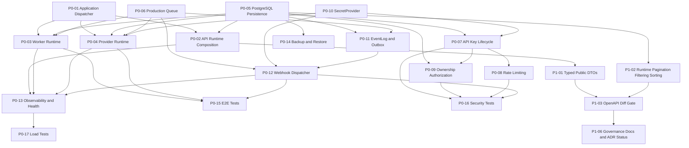

# OmniWA Production Readiness Execution Plan

## Executive Summary

OmniWA has completed Platform Evolution Phase A through Phase J and has a strong architecture foundation, but the latest readiness review concludes **FINAL VERDICT: NOT READY** for production-grade platform use.

This plan converts the review blockers into an execution backlog. It does not re-review the platform, redesign the architecture, or propose a rewrite.

Execution principles:

- Keep the current modular monolith and package dependency direction.
- Keep REST/OpenAPI/SDK as the public platform boundary.
- Keep Application command/query catalogs internal.
- Add production capability incrementally behind existing ports and adapters.
- Prefer additive runtime composition, repository adapters, projections, and security services.
- Every sprint must be testable and rollbackable.
- No client, SDK, or transport may contain business logic.

The shortest path to production is:

```text
Application execution
  -> Runtime composition
  -> PostgreSQL persistence
  -> Production queue and workers
  -> Provider runtime
  -> Security hardening
  -> Public contract stabilization
  -> Events/webhooks/realtime reliability
  -> Observability, backup, recovery, and performance gates
```

## Source Inputs

This plan is based on these current repository documents:

| Source                                                                                    | Role In This Plan                                                           |
| ----------------------------------------------------------------------------------------- | --------------------------------------------------------------------------- |
| `docs/reviews/PLATFORM_READINESS_REVIEW.md`                                               | Authoritative source for blockers and current readiness verdict.            |
| `docs/platform-evolution/EVOLUTION_PLAN.md`                                               | Incremental evolution principles and Phase A-J intent.                      |
| `docs/platform-evolution/MIGRATION_ROADMAP.md`                                            | Backward compatibility and rollback model.                                  |
| `docs/platform-evolution/PHASE_A_HTTP_TRANSPORT.md` through `PHASE_J_PLATFORM_CLIENTS.md` | Current implemented platform evolution status.                              |
| `docs/adr/ADR-0001-platform-boundary.md`                                                  | Public boundary: SDK -> REST -> Interface Adapter -> Application -> Domain. |
| `docs/adr/ADR-0002-rest-api.md`                                                           | REST as the public transport over Application commands/queries.             |
| `docs/adr/ADR-0003-sdk.md`                                                                | Official SDK as the client boundary.                                        |
| `docs/adr/ADR-0004-query-model.md`                                                        | Read projections for platform clients.                                      |
| `docs/adr/ADR-0005-realtime.md`                                                           | SSE as initial realtime transport.                                          |
| `docs/adr/ADR-0006-groups-domain.md`                                                      | Groups as an accepted first-class domain.                                   |
| `docs/adr/ADR-0007-public-contract.md`                                                    | OpenAPI as public contract source of truth.                                 |

## N11 Reconciliation Snapshot

This section reconciles the original production blockers with the current implementation state at
the start of N11. The original blocker definitions remain valid, but the next implementation work
must use this status overlay instead of restarting already-completed foundation sprints.

| ID    | N11 Status              | Evidence / Remaining Work                                                                                                                                                                                                                                                                                                                                                                                                                                                                                                                                                |
| ----- | ----------------------- | ------------------------------------------------------------------------------------------------------------------------------------------------------------------------------------------------------------------------------------------------------------------------------------------------------------------------------------------------------------------------------------------------------------------------------------------------------------------------------------------------------------------------------------------------------------------------ |
| P0-01 | Partially closed        | Application dispatcher and real handlers exist for the exposed read/mutation paths. Keep open only for production-path completeness verification.                                                                                                                                                                                                                                                                                                                                                                                                                        |
| P0-02 | Partially closed        | API runtime composition exists for local/dev and Docker local. Production profile hardening and unsafe-fallback refusal still need verification.                                                                                                                                                                                                                                                                                                                                                                                                                         |
| P0-03 | Partially closed        | Worker runtime and outbound job handlers exist. Production durability still depends on P0-06 queue semantics.                                                                                                                                                                                                                                                                                                                                                                                                                                                            |
| P0-04 | Ownership path closed   | Real Baileys provider, provider runtime, VS02 local-live proof, durable local ownership lease, PostgreSQL ownership lease, active lease renewal, and PostgreSQL contract tests exist. Production profile enablement still depends on P0-10 and P0-15.                                                                                                                                                                                                                                                                                                                    |
| P0-05 | Closed for exposed path | PostgreSQL repositories and CI contract tests cover runtime-exposed paths. Full catalog coverage remains follow-up, not the next N11 blocker.                                                                                                                                                                                                                                                                                                                                                                                                                            |
| P0-06 | Partial                 | Durable WorkerJob-backed queue provider exists behind `QueueProviderPort`; cross-process atomic leasing and final production queue semantics remain open.                                                                                                                                                                                                                                                                                                                                                                                                                |
| P0-07 | Mostly closed           | API key auth/lifecycle foundations exist, API runtime can compose from `OMNIWA_API_KEY_HASH`, `OMNIWA_API_KEY_LIFECYCLE_STORE_PATH`, or `SecretProvider` via `OMNIWA_API_KEY_SECRET_NAME` without retaining plaintext key config, the API process entrypoint wires the secret-name path through `EnvSecretProvider`, and admin `/v1/api-keys` list/provision/revoke/rotate routes exist behind `admin:*` with safe DTOs and audit evidence. Least-privilege depth and rate-limit hardening continue in N11.5.                                                            |
| P0-08 | Partial                 | Rate limiter foundation exists and API runtime composition can now opt in through `OMNIWA_API_RATE_LIMIT_MAX_REQUESTS`, `OMNIWA_API_RATE_LIMIT_WINDOW_MS`, and endpoint-class override env vars. Production distributed throttling, metrics export, and guardrail integration need hardening.                                                                                                                                                                                                                                                                            |
| P0-09 | Partial                 | Resource ownership checks exist for current surfaces. API runtime composition can opt in to in-memory denied-decision evidence with `OMNIWA_API_SECURITY_AUDIT_IN_MEMORY=true`, durable JSON denied-decision evidence with `OMNIWA_API_SECURITY_AUDIT_LOG_PATH`, and repository-backed ownership resolution with `OMNIWA_API_RESOURCE_OWNERSHIP_REPOSITORY=true` for session/message/chat/contact/group/job resources that carry explicit instance ownership. Full production ownership coverage, approved AuditRecord persistence, and regression depth need hardening. |
| P0-10 | Partial                 | Env/local secret providers exist, API process composition can use them for API key material, and provider runtime can encrypt durable Baileys auth-state JSON with `OMNIWA_BAILEYS_AUTH_STATE_ENCRYPTION_KEY` while preserving local backward compatibility for existing unencrypted state. Production external secret-provider selection and production-profile validation remain open.                                                                                                                                                                                 |
| P0-11 | Foundation closed       | Durable JSON EventLog/outbox and SSE replay survive restart. Production outbox consumers, selected production EventLog backend, and backlog metrics remain open.                                                                                                                                                                                                                                                                                                                                                                                                         |
| P0-12 | Partial                 | Webhook dispatcher runtime exists. Production durable retry/dead-letter/signing/replay hardening remains open.                                                                                                                                                                                                                                                                                                                                                                                                                                                           |
| P0-13 | Partial                 | Logging/health/readiness foundations exist. Production exporters, dashboards, alerts, and dependency SLOs remain open.                                                                                                                                                                                                                                                                                                                                                                                                                                                   |
| P0-14 | Open                    | Backup/restore implementation and drills remain open.                                                                                                                                                                                                                                                                                                                                                                                                                                                                                                                    |
| P0-15 | Partial                 | Broad unit/integration/regression gates exist. Production E2E path proof still needs hardening around durable queue/event/provider paths.                                                                                                                                                                                                                                                                                                                                                                                                                                |
| P0-16 | Partial                 | Security tests exist for current controls. Production auth/rate-limit/replay/ownership coverage remains open.                                                                                                                                                                                                                                                                                                                                                                                                                                                            |
| P0-17 | Partial                 | Load baseline tests exist. Production budgets and sustained runtime evidence remain open.                                                                                                                                                                                                                                                                                                                                                                                                                                                                                |

N11 should proceed in this order:

```text
N11.1 Production Queue Foundation (done)
  -> N11.2 Durable EventLog / Outbox / SSE Replay (done)
  -> N11.3 Provider Runtime Ownership (done)
  -> N11.4 Secret and API-Key Hardening (done)
  -> N11.5 Authorization and Rate Limits (current)
  -> N11.6 Webhook Reliability
  -> N11.7 Production Validation Gates
```

## Prioritized Backlog

### P0 - Required Before Production

| ID    | Blocker                                                                                                                          | Why P0                                                                                                          | Primary Dependency                                                               |
| ----- | -------------------------------------------------------------------------------------------------------------------------------- | --------------------------------------------------------------------------------------------------------------- | -------------------------------------------------------------------------------- |
| P0-01 | Implement real Application dispatcher/use-case handlers.                                                                         | REST currently reaches an interface boundary but cannot execute real platform behavior end to end.              | Existing Application command/query catalogs and repository/provider/queue ports. |
| P0-02 | Wire API runtime to real dispatcher and dependencies by default for non-test profiles.                                           | `apps/api` standalone fallback returns unavailable outcomes, so the platform is not operational.                | P0-01.                                                                           |
| P0-03 | Implement Worker runtime and job handler registry.                                                                               | Async accepted work cannot be processed in production without a worker process.                                 | P0-01, P0-05, P0-06.                                                             |
| P0-04 | Implement Provider runtime with Baileys socket lifecycle, session restore, signal translation, and one-owner-per-instance guard. | The platform cannot connect to WhatsApp reliably without a production provider runtime.                         | P0-01, P0-05, P0-06, P0-10.                                                      |
| P0-05 | Implement PostgreSQL persistence adapter, migrations, transaction strategy, indexes, and repository contract tests.              | JSON/in-memory storage is not the approved production source of truth and is not multi-process safe.            | Repository ports and Persistence Freeze.                                         |
| P0-06 | Implement production queue adapter with leasing, retry, dead-letter, concurrency, recovery, and metrics.                         | WorkerJob semantics cannot survive multi-process production without durable queue semantics.                    | Existing QueueProviderPort and WorkerJob domain.                                 |
| P0-07 | Implement API key lifecycle with hashed storage, constant-time verification, rotation, revocation, least privilege, and audit.   | Static env API keys are not production-grade authentication.                                                    | P0-05, Access/Audit domains.                                                     |
| P0-08 | Implement API rate limiting and abuse/guardrail throttling.                                                                      | Public API can be abused and cannot enforce responsible-use constraints at the transport boundary.              | P0-07, metrics/observability hooks.                                              |
| P0-09 | Implement ownership-aware authorization for all resource IDs.                                                                    | Scope checks are insufficient if non-instance IDs cannot be resolved to an authorized boundary.                 | P0-05, P0-07, read/resource ownership resolvers.                                 |
| P0-10 | Implement production SecretProvider adapter.                                                                                     | Session, webhook, API key, and provider secrets need a safe runtime secret boundary.                            | Configuration/secret contracts.                                                  |
| P0-11 | Implement EventLog/outbox persistence and SSE replay from durable events.                                                        | Realtime/event visibility cannot survive restart or provide reliable cursor replay without durable event state. | P0-05, P0-06.                                                                    |
| P0-12 | Wire webhook dispatcher as an app and complete concrete signing/replay verification.                                             | Webhook delivery is part of the platform contract and must be operational, retryable, and verifiable.           | P0-03, P0-06, P0-10, P0-11.                                                      |
| P0-13 | Add production observability exporters, dependency health/readiness checks, dashboards, and alerts.                              | Operators cannot run or recover the platform safely without visibility.                                         | P0-02 through P0-12 produce runtime signals.                                     |
| P0-14 | Add backup/restore implementation and restore drills.                                                                            | Durable production state is unsafe without verified recovery.                                                   | P0-05, P0-10.                                                                    |
| P0-15 | Add end-to-end tests for REST -> Application -> Domain -> Persistence/Queue/Provider paths.                                      | Current tests are strong but do not prove the production execution path.                                        | P0-01 through P0-06.                                                             |
| P0-16 | Add security tests for auth, rate limit, replay, redaction, webhook signing, and resource ownership.                             | Security controls need regression gates before public or internal production use.                               | P0-07 through P0-12.                                                             |
| P0-17 | Add load/performance tests and baseline budgets.                                                                                 | Production readiness requires known capacity, latency, and bottleneck evidence.                                 | P0-02, P0-05, P0-06, P0-13.                                                      |

### P1 - Required Before Public Platform Maturity

| ID    | Blocker                                                                          | Why P1                                                                                                       | Primary Dependency                      |
| ----- | -------------------------------------------------------------------------------- | ------------------------------------------------------------------------------------------------------------ | --------------------------------------- |
| P1-01 | Replace generic public response payloads with stable typed resource DTOs.        | OpenAPI/SDK consumers need stable resource contracts; internal Application outcome shapes must stop leaking. | P0-01, P0-02.                           |
| P1-02 | Implement list pagination/filter/search/sort in runtime, not only docs/OpenAPI.  | Public platform clients need predictable large-list behavior.                                                | P0-05, ADR-0004 query model.            |
| P1-03 | Add OpenAPI breaking-change/diff gate.                                           | OpenAPI is the public contract source of truth and needs compatibility enforcement.                          | P1-01.                                  |
| P1-04 | Turn webhook delivery dead-letter management into an operational API/read model. | Operators need visibility and remediation for failed integration delivery.                                   | P0-12, P0-13.                           |
| P1-05 | Complete logs/event query projections for operator visibility.                   | A platform needs searchable operational history, not only in-memory logging concepts.                        | P0-11, P0-13.                           |
| P1-06 | Update stale platform-evolution docs and ADR statuses.                           | Governance must match implementation state for external reviewers and maintainers.                           | Completion of P0/P1 contract decisions. |

### P2 - Can Follow Initial Production

| ID    | Item                                                              | Why P2                                                                                        | Primary Dependency |
| ----- | ----------------------------------------------------------------- | --------------------------------------------------------------------------------------------- | ------------------ |
| P2-01 | Split large API route table into route modules.                   | Maintainability issue, not a direct production blocker if tests and boundaries remain strong. | P1-01.             |
| P2-02 | Add semantic OpenAPI contract tests beyond route coverage.        | Improves long-term compatibility; basic OpenAPI gate already exists.                          | P1-03.             |
| P2-03 | Add SDK resource-specific typed DTO ergonomics for all resources. | Public DX improvement after stable DTOs exist.                                                | P1-01, P1-03.      |
| P2-04 | Add async SDK transport and retry/circuit-breaker helpers.        | Important for high-quality clients but not required for the backend production cut.           | P0-13, P1-01.      |
| P2-05 | Improve projection rebuild tooling and admin repair workflows.    | Operational maturity after projections are durable.                                           | P0-11, P1-05.      |

### P3 - Future Enhancement

| ID    | Item                                                                | Why P3                                                                      | Primary Dependency                           |
| ----- | ------------------------------------------------------------------- | --------------------------------------------------------------------------- | -------------------------------------------- |
| P3-01 | WebSocket transport.                                                | ADR-0005 keeps WebSocket deferred until bidirectional realtime is required. | Stable SSE and client demand.                |
| P3-02 | Advanced Group membership split into separate aggregate/read model. | ADR-0006 allows later split if scale/concurrency requires it.               | Production group usage evidence.             |
| P3-03 | Enterprise auth such as OAuth/SSO/RBAC.                             | Enterprise readiness, not required for first production platform gate.      | P0-07.                                       |
| P3-04 | Multi-region, sharding, and multi-tenant operations.                | Future scale path after single-tenant multi-instance production is stable.  | Production metrics and persistence maturity. |
| P3-05 | Full API Explorer product surface.                                  | Useful for developer experience, but OpenAPI/SDK are higher priority.       | P1-03.                                       |

## Dependency Graph

### Capability Dependency Graph



### Parallelization Rules

Can run in parallel:

- P0-01 Application dispatcher and P0-05 PostgreSQL design/adapter work can start together because both depend on existing ports, not each other.
- P0-06 production queue can start in parallel with P0-05 if queue storage boundaries are kept behind `QueueProviderPort`.
- P0-10 SecretProvider can start in parallel with P0-05.
- P1-01 typed DTO design can start once P0-01 handler outputs are stable, without waiting for provider runtime.

Must be sequential:

- P0-02 API runtime composition must follow P0-01 enough to avoid wiring a non-functional dispatcher.
- P0-03 Worker runtime must follow enough of P0-06 to avoid designing job execution around in-memory semantics.
- P0-04 Provider runtime must follow enough of P0-10 and P0-05 to handle sessions/secrets safely.
- P0-12 Webhook dispatcher must follow P0-06 and P0-11 for durable retry and event correlation.
- P0-15 E2E tests must follow at least one complete vertical slice.
- P0-17 load tests must follow a production-like runtime composition.

## Epic Breakdown

### Epic 1 - Application Execution Runtime

Goal:

- Convert Application catalogs and ports into executable use-case handlers without changing Domain rules or public REST resources.

Backlog:

- P0-01 real Application dispatcher.
- Handler registry for approved commands/queries.
- Use-case handlers for the first production vertical slice:
  - health/readiness,
  - instance list/detail/create/connect/disconnect,
  - send text/media message,
  - job status,
  - webhook register/status.
- Domain/application error mapping.
- Idempotency decision path for mutating commands.

Definition of Done:

- REST can execute at least one real command and one real query through Application without test-only dispatcher injection.
- Handlers depend on repository/provider/queue ports, not infrastructure implementations.
- Handler tests cover success, domain failure, infrastructure failure, idempotency, and authorization context propagation.
- Architecture boundary check remains green.

Rollback:

- Keep `ApiInterfaceAdapter` contract unchanged.
- Disable production dispatcher wiring and restore unavailable dispatcher for non-production profiles only.

### Epic 2 - Runtime Composition

Goal:

- Turn apps from shells into executable production processes with explicit dependency wiring.

Backlog:

- P0-02 API runtime composition.
- Runtime bootstrap for configuration, secrets, repositories, queue, observability, and dispatcher.
- Process lifecycle: startup validation, graceful shutdown, dependency readiness.
- Profile boundaries for local, test, and production.

Definition of Done:

- `apps/api` starts with a real dispatcher in non-test profile.
- Dependency graph is explicit and health/readiness can report missing dependencies.
- Runtime composition does not import Domain directly through transport handlers.
- Local/dev fallback remains available and clearly marked non-production.

Rollback:

- Runtime profile flag switches back to local/in-memory composition.

### Epic 3 - Production Persistence

Goal:

- Replace JSON/in-memory runtime storage with PostgreSQL for production source-of-truth state while preserving repository ports.

Backlog:

- P0-05 PostgreSQL repository adapter.
- Migration runner and schema evolution policy.
- Transaction/unit-of-work implementation.
- Repository contract tests against PostgreSQL.
- Index and query plan review for approved read/write paths.
- Backup/restore integration hooks.

Definition of Done:

- Production repository set can replace JSON repository set behind the same ports.
- Migrations are repeatable, rollback-aware, and tested.
- Repository contract tests pass for in-memory, JSON, and PostgreSQL where applicable.
- Transactions protect aggregate consistency boundaries defined in Domain/Persistence docs.

Rollback:

- Adapter-level rollback to JSON for non-production only.
- Production rollback requires migration rollback plan and restore validation.

### Epic 4 - Queue, Worker, and Async Reliability

Goal:

- Make async work durable, retryable, observable, and recoverable.

Backlog:

- P0-06 production queue adapter.
- P0-03 Worker runtime and job handler registry.
- Lease/visibility timeout.
- Retry/backoff/dead-letter.
- Idempotency key integration.
- Queue and worker metrics.
- Recovery process for abandoned jobs.

Definition of Done:

- Worker can process queued message/webhook/provider jobs through Application-owned handlers.
- No two workers can process the same job concurrently under normal lease semantics.
- Retry and dead-letter behavior is deterministic and tested.
- Queue metrics feed readiness and observability.

Rollback:

- Disable worker process per job type.
- Keep accepted commands returning queued/failed status without losing persisted intent.

### Epic 5 - Provider Runtime

Goal:

- Operate Baileys behind the approved provider abstraction without leaking provider logic into Domain, Application, API, SDK, or clients.

Backlog:

- P0-04 provider runtime process.
- Baileys socket lifecycle owner.
- Session restore and revocation handling.
- QR/auth lifecycle signal translation.
- One active provider runtime per instance.
- Provider failure classification.
- Provider capability enforcement for message/group operations.

Definition of Done:

- Provider runtime can connect, reconnect, restore session, and emit safe provider/application signals.
- API and Application never import Baileys.
- Provider failures map to approved provider errors.
- Runtime prevents concurrent active provider ownership for the same instance.

Rollback:

- Disable provider runtime for selected instances.
- Keep instance/action-required state visible through API.

### Epic 6 - Security Foundation

Goal:

- Move from minimal API key middleware to production-grade platform authentication, authorization, secrets, rate limits, and audit.

Backlog:

- P0-07 API key lifecycle.
- P0-08 rate limiting and abuse throttling.
- P0-09 ownership-aware authorization.
- P0-10 production SecretProvider.
- P0-16 security test suite.
- Audit events for public operations.

Definition of Done:

- API keys are stored hashed and verified constant-time.
- Rotation and revocation are audited.
- Rate limits exist by key, instance, and endpoint class; the current runtime-wired limiter is
  opt-in in-memory and must be replaced or backed by a distributed adapter before multi-process
  production.
- Resource IDs resolve to ownership before authorization decisions; the current repository-backed
  resolver covers instance-owned resource aggregates and fails closed for unsupported resources when
  enabled.
- Denied security decisions produce safe evidence; the current runtime-wired sinks are opt-in
  in-memory or durable JSON and must be mapped to approved AuditRecord storage before production
  promotion.
- Secret values are never logged or serialized.
- Security regression tests are part of `pnpm check` or a required CI gate.

Rollback:

- Keep env API key only in local/dev profile.
- Feature-flag stricter limits during rollout, but production profile must require them before production gate.

### Epic 7 - Public API Contract Stabilization

Goal:

- Make OpenAPI/SDK stable for external clients without exposing Application outcomes.

Backlog:

- P1-01 typed resource DTOs.
- P1-02 runtime pagination/filter/search/sort.
- P1-03 OpenAPI breaking-change/diff gate.
- SDK resource-specific typed models.
- DTO mapping from Application outcomes to public resources.

Definition of Done:

- Public `data` payloads no longer expose `ApplicationCommandOutcome` or `ApplicationQueryOutcome`.
- Collection endpoints enforce cursor pagination and safe limits.
- OpenAPI diff gate blocks breaking changes without versioning/deprecation policy.
- SDK tests prove resource DTO decoding.

Rollback:

- Additive `/v1` fields only.
- If a DTO is unstable, keep it behind a new route or documented beta field rather than changing existing semantics.

### Epic 8 - Events, Webhooks, and Realtime Reliability

Goal:

- Make platform events replayable, webhooks reliable, and SSE backed by durable state.

Backlog:

- P0-11 EventLog/outbox.
- P0-12 webhook dispatcher app.
- Event retention and cursor semantics.
- Webhook HMAC/timestamp signing.
- Webhook replay protection.
- Delivery dead-letter operations.

Definition of Done:

- `GET /v1/events` and `/v1/events/stream` read from durable event state.
- SSE resume behavior works after process restart within retention limits.
- Webhook delivery retries and DLQ survive restart.
- Webhook signatures can be verified by consumers and tested with fixtures.

Rollback:

- Disable SSE and instruct clients to poll.
- Pause webhook dispatch per subscription while preserving queued delivery state.

### Epic 9 - Observability, Operations, and Recovery

Goal:

- Make OmniWA operable under production failure modes.

Backlog:

- P0-13 observability exporters, dashboards, alerts, dependency health.
- P0-14 backup/restore implementation and drills.
- P0-17 load/performance tests.
- Operational runbooks.
- Incident rollback procedures.

Definition of Done:

- API, worker, provider, queue, webhook, persistence, and event components emit structured logs, metrics, traces, and health.
- Dashboards cover SLOs and blocker-specific dependencies.
- Backup restore is tested against a production-like environment.
- Load tests produce baseline latency, throughput, error rate, and capacity budgets.

Rollback:

- Observability additions are side-effect-free.
- Backup tooling rollback must not affect primary runtime path.

### Epic 10 - Governance and Documentation Hygiene

Goal:

- Keep implementation state, ADR status, and platform-evolution docs accurate.

Backlog:

- P1-06 stale docs and ADR status cleanup.
- Production runbooks.
- Compatibility policy updates.
- Release checklist updates.

Definition of Done:

- ADR statuses reflect implemented/accepted/deferred decisions.
- Platform-evolution docs no longer state obsolete facts such as missing REST/OpenAPI/SDK when they exist.
- Production readiness status is discoverable from README/docs.
- Release checklist references the new production gates.

Rollback:

- Documentation changes can be reverted independently, but must not contradict implemented production gates.

## Sprint Plan

### Sprint PR-0 - Execution Baseline And Governance Prep

Goal:

- Prepare production execution without code behavior changes.

Deliverables:

- Confirm P0/P1 backlog ownership.
- Create issue backlog from this plan.
- Mark ADR status cleanup candidates.
- Define production profile naming and gate names.

Dependencies:

- None beyond the current review and platform-evolution docs.

Acceptance Criteria:

- Every P0 blocker has an issue, owner, target epic, and test expectation.
- No code path changes.
- No freeze document changes without ADR policy.

Definition of Done:

- Backlog is traceable to `PLATFORM_READINESS_REVIEW.md`.
- `pnpm check` remains green.

Risks:

| Risk                                | Mitigation                                               |
| ----------------------------------- | -------------------------------------------------------- |
| Planning drift into redesign        | Keep issue text tied to blocker IDs and existing ADRs.   |
| ADR status changes become premature | Only update status after implementation evidence exists. |

### Sprint PR-1 - Application Dispatcher Vertical Slice

Goal:

- Execute one real read path and one real command path through Application.

Deliverables:

- Production dispatcher skeleton.
- Handler registry.
- Handlers for `GetHealthStatus`, `ListInstances`, and one safe command such as `CreateInstance`.
- Domain/application error mapping.

Dependencies:

- Epic 1.

Acceptance Criteria:

- API tests can use the real dispatcher for selected routes.
- No route imports Domain or Infrastructure directly.
- Existing mock/fixture tests still pass.

Definition of Done:

- Unit tests and integration tests cover success/failure.
- Architecture boundary check passes.

Risks:

| Risk                               | Mitigation                                          |
| ---------------------------------- | --------------------------------------------------- |
| Dispatcher becomes service locator | Keep dependencies explicit per handler group.       |
| Business rules drift into handlers | Handler tests assert domain rules remain in Domain. |

### Sprint PR-2 - API Runtime Composition

Goal:

- Start `apps/api` with real non-test dependencies for selected vertical slice.

Deliverables:

- Runtime composition module.
- Local/dev profile using in-memory or JSON adapters.
- Production profile validation that refuses unsafe fallback dispatcher.
- Graceful startup/shutdown hooks.

Dependencies:

- PR-1.

Acceptance Criteria:

- Non-test API profile does not silently use unavailable dispatcher.
- `/v1/health` can report runtime dependency status.
- Rollback to local profile is explicit.

Definition of Done:

- Runtime tests cover missing config, valid config, and shutdown.
- `pnpm check` passes.

Risks:

| Risk                                | Mitigation                                  |
| ----------------------------------- | ------------------------------------------- |
| Breaking local development          | Keep local profile explicit and documented. |
| Hidden dependency import violations | Extend architecture tests if needed.        |

### Sprint PR-3 - PostgreSQL Adapter Foundation

Goal:

- Add production persistence foundation behind repository ports.

Deliverables:

- Migration runner skeleton.
- PostgreSQL connection abstraction.
- First repository adapter vertical slice for Instance and supporting indexes.
- Repository contract test harness.

Dependencies:

- Epic 3.

Acceptance Criteria:

- Existing repository ports remain unchanged.
- Contract tests run against in-memory, JSON, and PostgreSQL-compatible adapter where available.
- No Domain/Application changes are required for adapter replacement.

Definition of Done:

- Migration tests are repeatable.
- Transaction boundary is documented in test names and implementation notes.

Risks:

| Risk                                      | Mitigation                                                   |
| ----------------------------------------- | ------------------------------------------------------------ |
| Physical schema diverges from freeze docs | Require schema review against persistence docs before merge. |
| Adapter leaks persistence model           | Contract tests assert repository-port shape only.            |

### Sprint PR-4 - Production Queue Foundation

Goal:

- Implement durable queue semantics behind `QueueProviderPort`.

Deliverables:

- Queue adapter with enqueue/reserve/ack/retry/dead-letter.
- Lease and visibility timeout semantics.
- Queue metrics hooks.
- Queue contract tests.

Dependencies:

- PR-3 can run in parallel if queue implementation is isolated; final production profile needs both.

Acceptance Criteria:

- Two worker simulations cannot reserve the same job simultaneously.
- Retry and dead-letter state survive adapter restart.
- Queue metrics are emitted.

Definition of Done:

- Unit, contract, and restart tests pass.
- In-memory adapter remains for tests/local.

Risks:

| Risk                                              | Mitigation                                                                         |
| ------------------------------------------------- | ---------------------------------------------------------------------------------- |
| Queue semantics conflict with WorkerJob lifecycle | Map queue states to WorkerJob states through Application, not directly in adapter. |
| Retry behavior becomes non-deterministic          | Use injected Clock in tests.                                                       |

### Sprint PR-5 - Worker Runtime Vertical Slice

Goal:

- Process one durable job type end to end.

Deliverables:

- Worker app runtime.
- Job handler registry.
- Handler for selected message or webhook job.
- Retry/dead-letter operational logs and metrics.

Dependencies:

- PR-1, PR-3, PR-4.

Acceptance Criteria:

- A queued job can be reserved, executed, acknowledged, retried, or dead-lettered.
- Worker does not call API layer.
- Worker goes through Application services/ports.

Definition of Done:

- E2E test covers enqueue -> worker -> repository state update.
- Architecture boundary check passes.

Risks:

| Risk                        | Mitigation                                       |
| --------------------------- | ------------------------------------------------ |
| Worker bypasses Application | Add architecture test and code review checklist. |
| Failed jobs loop endlessly  | Enforce retry cap and dead-letter reason.        |

### Sprint PR-6 - Secret Provider And API Key Lifecycle

Goal:

- Replace static-only auth posture with production API key and secret management foundations.

Deliverables:

- SecretProvider implementation.
- API key lifecycle service.
- Hashed key storage.
- Constant-time verification.
- Rotation/revocation.
- Audit events.

Dependencies:

- PR-3 for durable storage.

Acceptance Criteria:

- Production profile cannot use plaintext persistent API key storage.
- Revoked keys fail.
- Rotated keys produce audit records.
- Secrets do not appear in logs, JSON, or errors.

Definition of Done:

- Security tests cover auth success/failure/rotation/revocation/redaction.
- `pnpm check` passes.

Risks:

| Risk                                  | Mitigation                               |
| ------------------------------------- | ---------------------------------------- |
| Locking out development workflows     | Keep env key only for local/dev profile. |
| Secret leakage through test snapshots | Add redaction assertions.                |

### Sprint PR-7 - Authorization And Rate Limits

Goal:

- Enforce platform access boundaries and abuse controls.

Deliverables:

- Ownership resolver for instance, message, group, webhook, delivery, job, event resources.
- Repository-backed ownership resolver for instance-owned resources.
- Runtime-wired rate limiter by API key, instance, and endpoint class.
- Guardrail throttling hooks.
- Runtime-wired denied-decision audit evidence.

Dependencies:

- PR-6, PR-3.

Acceptance Criteria:

- Non-owned resource IDs are rejected.
- Rate limit errors use public error envelope.
- Limits are observable via metrics.
- Admin bypass rules are explicit and audited.

Definition of Done:

- Security tests cover cross-resource access and limit exhaustion.
- Public routes remain resource-oriented.

Risks:

| Risk                                    | Mitigation                                                                                 |
| --------------------------------------- | ------------------------------------------------------------------------------------------ |
| Ownership resolver causes extra DB load | Start with indexed lookup paths and measure in PR-17.                                      |
| Rate limits break internal operations   | Separate public/admin/internal runtime boundaries.                                         |
| In-memory limits reset per process      | Keep as local/runtime foundation; add distributed adapter before multi-process production. |

### Sprint PR-8 - Provider Runtime Vertical Slice

Goal:

- Run provider lifecycle for one instance safely behind `MessagingProviderPort`.

Deliverables:

- Provider runtime app.
- Socket lifecycle owner.
- Session restore path.
- QR/auth/connection signal translation.
- One active runtime guard.
- Provider error classification.

Dependencies:

- PR-1, PR-3, PR-4, PR-6.

Acceptance Criteria:

- Provider runtime can enter connected/disconnected/action-required states.
- Session secrets use SecretProvider.
- No Baileys import outside the approved adapter package.
- Duplicate active runtime is rejected or fenced.

Definition of Done:

- Provider lifecycle tests and failure tests pass.
- Runtime metrics and logs exist.

Risks:

| Risk                             | Mitigation                                                  |
| -------------------------------- | ----------------------------------------------------------- |
| Provider instability affects API | Keep provider runtime isolated from API process.            |
| Session corruption               | Add one-owner guard and restore tests before broad rollout. |

### Sprint PR-9 - EventLog, Outbox, SSE Replay

Goal:

- Make platform events durable and replayable.

Deliverables:

- EventLog/outbox persistence.
- Event publisher path from Application/runtime outcomes.
- SSE source backed by durable EventLog.
- Retention-aware cursor behavior.

Dependencies:

- PR-3, PR-4, PR-5.

Acceptance Criteria:

- Event stream can resume after process restart.
- Expired cursor behavior is deterministic and safe.
- Event payloads remain redacted and public-safe.

Definition of Done:

- Event replay tests and restart tests pass.
- OpenAPI/SKD stream contract remains compatible.

Risks:

| Risk                   | Mitigation                                         |
| ---------------------- | -------------------------------------------------- |
| Event duplication      | Add idempotent event ID and consumer cursor tests. |
| Sensitive data leakage | Enforce safe event envelope tests.                 |

### Sprint PR-10 - Webhook Runtime Reliability

Goal:

- Operate webhook delivery as a production runtime.

Deliverables:

- Webhook dispatcher app.
- Durable delivery queue integration.
- HMAC/timestamp signing.
- Replay protection guidance and tests.
- Retry/dead-letter management.

Dependencies:

- PR-4, PR-5, PR-6, PR-9.

Acceptance Criteria:

- Webhook delivery survives process restart.
- Failed deliveries retry and then dead-letter.
- Signatures are verifiable by fixtures.
- Dispatcher does not call API layer.

Definition of Done:

- E2E webhook success/failure/DLQ tests pass.
- Metrics and audit entries are emitted.

Risks:

| Risk                                    | Mitigation                                   |
| --------------------------------------- | -------------------------------------------- |
| Consumer downtime causes backlog growth | Add backpressure metrics and DLQ operations. |
| Signature compatibility drift           | Maintain stable signing test vectors.        |

### Sprint PR-11 - Public DTO And Query Contract Stabilization

Goal:

- Stop leaking Application outcome shapes and make list APIs production-useful.

Deliverables:

- Typed resource DTOs for core public resources.
- Application-to-DTO mappers.
- Runtime cursor/limit/filter/sort/search mapping.
- OpenAPI schema update.
- SDK DTO decoding tests.

Dependencies:

- PR-1, PR-2, PR-3.

Acceptance Criteria:

- No public response exposes `kind: "command_outcome"` or `kind: "query_outcome"`.
- Collection endpoints enforce max limits and return cursor metadata.
- Filters and sorts are whitelisted.

Definition of Done:

- OpenAPI check and SDK tests pass.
- Backward compatibility review is complete.

Risks:

| Risk                                           | Mitigation                                      |
| ---------------------------------------------- | ----------------------------------------------- |
| Breaking existing pre-production SDK consumers | Use additive fields and compatibility notes.    |
| Mapper duplicates business logic               | Mappers only translate state, not decide rules. |

### Sprint PR-12 - OpenAPI Diff Gate And SDK Compatibility

Goal:

- Protect the public platform contract after typed DTOs exist.

Deliverables:

- OpenAPI diff/breaking-change gate.
- SDK regeneration/compatibility check.
- Changelog/deprecation workflow.
- API compatibility policy test cases.

Dependencies:

- PR-11.

Acceptance Criteria:

- Breaking OpenAPI changes fail CI unless explicitly versioned.
- SDK tests prove compatibility with fixture responses.
- Deprecation metadata is documented.

Definition of Done:

- `pnpm check` includes or references the compatibility gate.
- Release readiness gate verifies API contract status.

Risks:

| Risk                            | Mitigation                                    |
| ------------------------------- | --------------------------------------------- |
| Gate blocks legitimate refactor | Provide explicit versioning/deprecation path. |
| Generated SDK drift             | Keep OpenAPI as source of truth.              |

### Sprint PR-13 - Observability And Dependency Readiness

Goal:

- Make production runtime visible and operable.

Deliverables:

- Structured log backend adapter.
- Metrics exporter.
- Trace exporter.
- Health/readiness checks for DB, queue, provider, event log, webhook dispatcher.
- Dashboard and alert definitions.

Dependencies:

- PR-2 through PR-10.

Acceptance Criteria:

- Readiness fails when critical dependencies fail.
- Metrics cover API latency, queue latency, provider connection state, webhook success, worker utilization, event stream errors.
- Alerts exist for production P0 failure modes.

Definition of Done:

- Observability tests and smoke checks pass.
- Runbook references metrics and alerts.

Risks:

| Risk                                | Mitigation                                              |
| ----------------------------------- | ------------------------------------------------------- |
| Observability cardinality explosion | Define approved labels and reject raw IDs where unsafe. |
| Readiness flaps                     | Separate liveness, readiness, and degraded health.      |

### Sprint PR-14 - Backup, Restore, And Recovery Drill

Goal:

- Prove production state can be recovered.

Deliverables:

- Backup job wiring.
- Restore procedure.
- Restore validation test/drill.
- Recovery runbook.
- RPO/RTO verification.

Dependencies:

- PR-3, PR-6, PR-13.

Acceptance Criteria:

- Restore drill can recover a production-like dataset.
- Secret material recovery boundaries are explicit.
- RPO/RTO results are recorded.

Definition of Done:

- Recovery drill is repeatable.
- Release readiness references backup/restore status.

Risks:

| Risk                             | Mitigation                                             |
| -------------------------------- | ------------------------------------------------------ |
| Backups contain secrets unsafely | Use SecretProvider boundaries and encryption controls. |
| Restore procedure is untested    | Require drill before production gate.                  |

### Sprint PR-15 - End-to-End And Security Regression Gates

Goal:

- Convert production blockers into automated regression gates.

Deliverables:

- E2E test suite for REST -> Application -> Domain -> DB/Queue/Provider stub.
- Security tests for auth, authorization, rate limit, replay, webhook signing, redaction.
- CI gate integration.

Dependencies:

- PR-5, PR-7, PR-8, PR-10.

Acceptance Criteria:

- Core production vertical slices are covered by E2E tests.
- Security failures block merge.
- Tests do not require real WhatsApp network access.

Definition of Done:

- Quality gates are documented and reproducible locally.
- `pnpm check` or a named production gate runs all required tests.

Risks:

| Risk                        | Mitigation                                                                  |
| --------------------------- | --------------------------------------------------------------------------- |
| E2E tests become flaky      | Use provider stubs and deterministic clocks.                                |
| Test runtime grows too much | Separate fast gate and production-readiness gate while keeping CI required. |

### Sprint PR-16 - Load Baseline And Production Cut Review

Goal:

- Establish measurable production readiness and move from NOT READY to CONDITIONALLY READY or PRODUCTION READY.

Deliverables:

- Load/performance tests.
- Capacity assumptions.
- Latency/throughput/error budgets.
- Final production readiness review.
- Governance docs and ADR status cleanup.

Dependencies:

- PR-13, PR-14, PR-15.

Acceptance Criteria:

- Baseline load targets are met or explicitly documented as constraints.
- Top P0 blockers are closed.
- ADR/platform-evolution status matches implementation.
- Production gate checklist passes.

Definition of Done:

- Final readiness decision is recorded.
- Release readiness check reflects production gate state.

Risks:

| Risk                                     | Mitigation                                                          |
| ---------------------------------------- | ------------------------------------------------------------------- |
| Late performance bottlenecks             | Run partial load tests earlier on PR-11 and PR-13 where possible.   |
| Governance cleanup hides unresolved work | Link every status update to passing tests and implemented evidence. |

## Roadmap Check

The existing Phase A-J roadmap was correct for platform foundation, but it is not enough for production readiness.

Keep:

- Platform boundary from ADR-0001.
- REST resource strategy from ADR-0002.
- SDK boundary from ADR-0003.
- Projection strategy from ADR-0004.
- SSE-first realtime strategy from ADR-0005.
- Groups domain model from ADR-0006.
- OpenAPI public contract role from ADR-0007.
- Additive, rollbackable phase model from `MIGRATION_ROADMAP.md`.

Change:

- Add a new production-readiness roadmap after Phase J instead of declaring Platform Ready.
- Move production runtime, persistence, queue, security, and observability before any real client rollout.
- Treat JSON durable persistence as a stepping stone, not a production persistence phase.
- Treat client foundations as contract consumers, not proof of backend production readiness.

Do not change:

- Existing frozen architecture/domain/application/API/persistence/infrastructure decisions without ADR.
- Package dependency direction.
- Public boundary: SDK -> REST -> Interface Adapter -> Application -> Domain.
- Rule that TUI/CLI/Web/MCP clients do not contain business logic.

## Production Gates

### Gate 0 - NOT READY

Current status.

Conditions:

- One or more P0 blockers remain open.
- Production runtime path is not fully executable.
- Production persistence, queue, provider runtime, auth lifecycle, or observability is incomplete.

Allowed activity:

- Development and integration behind architecture gates.
- No production deployment claim.
- No public platform support claim.

### Gate 1 - CONDITIONALLY READY

Conditions:

- P0-01 through P0-12 are complete for the approved production vertical slice.
- PostgreSQL, queue, API, worker, provider runtime, event log, webhook dispatcher, auth, rate limit, secrets, and authorization are wired in a production profile.
- P0-15 and P0-16 pass for the production vertical slice.
- Observability provides enough health/metrics/logs to operate the vertical slice.
- Backup/restore procedure exists and has at least one successful drill.
- Known limitations are documented and enforced by config/capability flags.

Allowed activity:

- Internal controlled production pilot.
- Limited traffic.
- No broad public platform claim.

### Gate 2 - PRODUCTION READY

Conditions:

- All P0 blockers are closed.
- P1-01, P1-02, and P1-03 are complete for public API stability.
- E2E, security, load, release readiness, architecture, OpenAPI, SDK, and recovery gates pass.
- SLOs, dashboards, alerts, runbooks, and incident response are usable.
- No critical security or reliability findings remain open.
- Public contract has compatibility enforcement and deprecation policy.

Allowed activity:

- Production deployment for intended single-tenant multi-instance platform scope.
- Public REST/OpenAPI/SDK support for documented resources.

### Gate 3 - ENTERPRISE READY

Conditions:

- Production Ready conditions remain green over sustained operation.
- Enterprise auth/RBAC/SSO or approved equivalent exists.
- Audit completeness is proven for privileged operations.
- Compliance, key management, backup encryption, retention, and operational controls are documented and tested.
- Multi-node/high-availability strategy is implemented where required.
- Performance and DR targets are proven under production-like load.
- Support, release, incident, and security response processes are mature.

Allowed activity:

- Enterprise/customer-critical deployments with contractual operational expectations.

## Success Metrics

| Metric                           |                     Target For Conditional Ready |                       Target For Production Ready |
| -------------------------------- | -----------------------------------------------: | ------------------------------------------------: |
| P0 blocker closure               |                 100% for selected vertical slice |                100% for platform production scope |
| `pnpm check`                     |                                             PASS |                                              PASS |
| Rust SDK tests                   |                                             PASS |                                              PASS |
| Architecture boundary violations |                                                0 |                                                 0 |
| OpenAPI route coverage           |                        100% for supported routes | 100% for supported routes plus compatibility gate |
| E2E critical path tests          |                          PASS for selected slice |                  PASS for all P0 production paths |
| Security regression tests        | PASS for auth/authz/rate/webhook/redaction slice |              PASS for all public/admin boundaries |
| API availability target          |                          >= 99.0% internal pilot |      >= 99.5% production target or documented SLO |
| Webhook success rate             |      >= 95% in pilot excluding receiver failures |                >= 99% excluding receiver failures |
| Queue job duplicate processing   |              0 known duplicates in test baseline |       0 known duplicates in production gate tests |
| Restore validation               |                               1 successful drill |           Scheduled, repeatable successful drills |
| P95 API latency                  |                                Baseline recorded |                 Meets documented endpoint budgets |
| Critical alert coverage          |                        Core runtime dependencies |                       All P0 runtime dependencies |

## Exit Criteria

This plan is complete when:

- Every P0 blocker has an implemented, tested, and reviewed resolution.
- Production profile can run API, worker, provider runtime, webhook dispatcher, persistence, queue, event log, secrets, and observability together.
- Public API no longer exposes internal Application outcome shapes.
- Security controls include auth lifecycle, ownership authorization, rate limiting, secret management, webhook signing, replay protection, and audit.
- Durable persistence, queue, event log, and webhook delivery survive restart.
- Backup/restore and load/performance baselines are proven.
- Production gates are documented in release readiness tooling.
- ADR and platform-evolution documentation reflect the implemented state.

## Final Recommendation

Do not start by adding more client features. The next work should be production platform execution.

Recommended next sprint:

1. Start **N11.4 / Secret and API-Key Hardening** immediately.
2. Keep **PR-1**, **PR-2**, and **PR-3** as historical foundation references; do not restart them
   unless a regression proves a specific foundation gap.
3. Do not promote OmniWA beyond **NOT READY** until secret hardening, authorization/rate limits,
   webhook reliability, and production validation gates are implemented and tested.
4. Do not broaden TUI/Web/CLI/MCP capabilities until the backend production profile is at least
   **CONDITIONALLY READY**.
